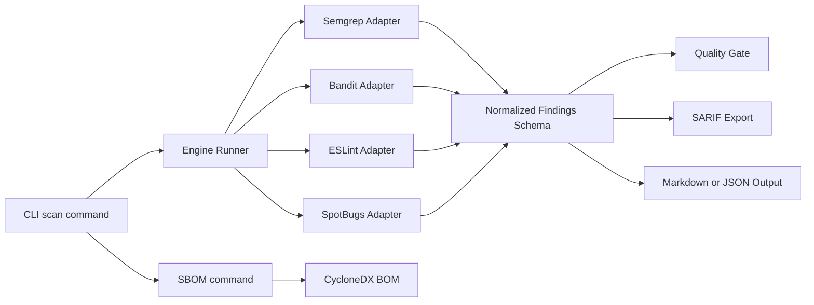

# PolyScan Executive Summary

## Ziel
PolyScan ist ein leichtgewichtiger Orchestrator für statische Codeanalyse (SAST) und Codequalität über mehrere Programmiersprachen.  
Statt ein weiteres Scanning-Tool zu bauen, bündelt PolyScan etablierte Open-Source-Engines in einem einheitlichen Workflow.

## Geschäftlicher Nutzen
- Ein Kommando für mehrere Scanner statt Tool-Silos pro Sprache.
- Einheitliches Ergebnisformat für Security, QA und CI/CD.
- Klare Build-Entscheidung über Quality Gate (pass/fail).
- Direkte Verwendbarkeit in GitHub-Code-Scanning- und Reporting-Pipelines (SARIF).
- Niedrige Betriebshürde: self-hosted, containerisierbar, Open Source.

## Kernfunktionen
- Multi-Engine Scans über Semgrep, Bandit, ESLint und SpotBugs.
- Normalisierung aller Findings in ein gemeinsames Schema.
- Quality Gate mit definierten Schwellwerten.
- Report-Ausgabe in Markdown, JSON und SARIF.
- SBOM-Erstellung (CycloneDX) aus gängigen Dependency-Manifesten.
- Optionale Web-API für einfache Integration in Dashboards.

## Technischer Aufbau
- Adapter-Architektur pro Engine für entkoppelte Erweiterbarkeit.
- Core-Schicht für Orchestrierung, Normalisierung, Gate-Logik und Export.
- CLI als primäre Bedienoberfläche, ergänzt durch minimale FastAPI-Endpoints.
- GitHub Action und Docker-Image für CI/CD- und Container-Betrieb.

### Architekturübersicht

## Qualitätsstand
- Testabdeckung für zentrale Flows:
  - End-to-End Scan inkl. Gate-Verhalten
  - SARIF-Struktur und Regel-Deduplikation
  - SBOM-Format und Component-Deduplikation

## Aktueller Reifegrad
- Solide Basis für Security-Scans in kleinen bis mittleren Repositories.
- Roadmap enthält Trendhistorie, weitere Engine-Integrationen und PR-Kommentierung.
- Architektur ist so ausgelegt, dass zusätzliche Engines mit überschaubarem Aufwand ergänzt werden können.

## Einordnung
PolyScan adressiert ein klares Praxisproblem: heterogene Toolchains für statische Analyse.  
Der größte Mehrwert liegt in der Vereinheitlichung, der automatisierbaren Gate-Entscheidung und der CI-freundlichen Ausgabeformate.
